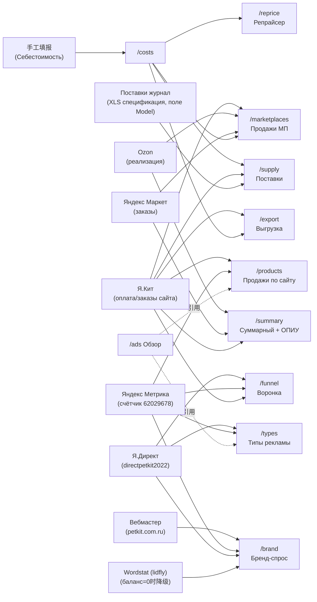

# RU PETKIT 取证证据包 (2026-09-28, 只读)

- 对象: `https://report.petkit-api.ru`, 会话 `china` (复用登录态, 全程只读, 无写操作).
- 方法: 每路由 `networkidle` 后取 `document.title` + `body.innerText` 全文 + 全页截图; 网络面板只记录请求 URL 与响应顶层结构, 不存全量业务数据.
- 复访结论: 11 路由全部 `200`, `title` 均为 `PETKIT · Реклама`; 任抽 `/ads`(ДРР 7,5%), `/summary`(Сен маржа 21,6%), `/export`(5 SKU 缺成本名单) 与抄录一致.
- 截图: `shots/01-overview.webp` … `shots/11-export.webp` (11 张, 全页).
- 小样本: `export-sample-pk44.csv` (按 `sku=pk44` + 单日 `2026-09-27` 过滤, 5 行, 17 列) — 仅用于提取列头.
- 验算: ДРР = 376307 / 5006199 = 7.517% → 页显 `7,5%` ✓; живыми 219441 / 5006199 = 4.38% → `4,4%` ✓; `/summary` Сен маржа 8402187 / 38869775 = 21.615% → `21,6%` ✓; MP 页 маржа = продажи − удержания − себестоимость − реклама (49049760 − 25338762 − 11779723 − 1136758 = 10794517 ≈ 页显 10794528, 舍入差) ✓; Ozon 30 天同样成立 ✓; ROI = маржинальная прибыль / себестоимость (13235957/12903441 = 102.6% ✓, 11151897/14452422 = 77.2% ✓).

## 路由证据 (每节: 路由 / 数据来源行原文 / 筛选器 / 指标 / 截图 / 备注)

### 01 `/ads` — Обзор (总览)
- 来源行: `Источники: Яндекс Директ · Я.Кит · Яндекс Метрика · магазин на Я.Кит с 08.06`.
- 筛选器: `7 дней / 14 дней / Месяц / Всё`.
- 周期 `15.09–28.09`: ДРР `7,5% / 4,4% живыми`; Выручка чистыми `5 006 199 ₽`; Расход `376 307 ₽ (219 441 ₽ живыми)`; Оплачено заказов `472 / 542`; Средний чек `10 606 ₽`; Цель ДРР ≤ 20%, отклонение −12,5 п.п.
- 02 ДИНАМИКА (按日): Выручка/Расход/ДРР(右轴) 曲线.
- 03 СТРУКТУРА: расход按类型 — Смарт-баннеры 3 716 749 ₽ 36,5% / Ретаргет 3 540 113 ₽ 34,8% / Бренд 1 086 796 ₽ 10,7% / Поиск 1 039 359 ₽ 10,2% / Медийная 802 707 ₽ 7,9%; выручка按类目 — Лотки 60,9% / Фонтаны 14,2% / Кормушки 10,9% / Наполнитель 8,4% / Груминг 2,4% / CARE+ 1,8% / Миски 0,7% / Прогулка 0,4% / Аксессуары 0,2% / Прочее 0,2%.
- 04 ТОП ТОВАРОВ: `ДРР по товару не считаем`; PK39_2 9 979 200 ₽ 21,6% / PK44 8 116 896 ₽ 17,6% / PK41_2 7 581 000 ₽ 16,4% / PK56 3 219 434 ₽ 7,0% / PKES5_2 2 633 980 ₽ 5,7% / pkl_3set 1 855 355 ₽ 4,0%; 注 `Доля — от чистой выручки. Доля рекламного бюджета по товару недоступна: расход Директа не делится на SKU, кампании построены по типам и категориям`.
- 截图: `01-overview.webp`.

### 02 `/ads/products` — Продажи по сайту
- 来源行: `источник — Я.Кит / Метрика`.
- 筛选器: ПЕРИОД (`31.08.26 — 04.10.26`, 日历 + Текущий месяц/30 дней/3/6/12 месяцев); КАТАЛОГ (`⚙ Товары`, Скрытые 5); ДЕТАЛИЗАЦИЯ (По дням/неделям/месяцам); АРТИКУЛ · ПОКАЗАТЕЛЬ (Все товары ▾).
- KPI: ПРОДАЖИ 1 624 шт 14 179 698 ₽; КОРЗИН CR 34% 4 764; ПЕРЕХОДЫ CR 1% 137 832; МАРЖА 5 348 272 ₽ 38,3%; ДРР 1 658 499 ₽ 11,7% (7,3% живыми).
- SKU 行指标: Продаж шт/₽; ▶Расходы площадки ₽ (可展开: Эквайринг/Логистика/Реклама живыми/ДРР живыми); Маржа по продажам %/₽; Маржа по заказам %/₽; Ср. чек; Корзин; Переходы всего; Остаток / дней до OOS. 例 PK44 Ср. чек 57 658 ₽.
- 导出: `↓ Экспорт CSV` → 客户端 Blob `Prodazhi_po_saytu.csv`, 列 = Показатель + 各周期 + Total; SKU 行列: `sku+name | Продаж, шт | Продаж, ₽ | Расходы площадки, ₽ | Эквайринг, ₽ | Логистика, ₽ | Реклама живыми, ₽ | ДРР живыми, % | Маржа по продажам, % | Маржа по продажам, ₽ | Маржа по заказам, % | Ср. чек | Корзин | Переходы, всего | Остаток`.
- 页面数据为服务端直出内嵌 `ROWS=[…]` (无 `__NEXT_DATA__`, 无每页 JSON 接口).
- 截图: `02-products.webp`.

### 03 `/ads/marketplaces` — Продажи по маркетплейсам
- 来源行: `источник — Озон · Яндекс Маркет · Сайт`; 页脚 `Источники: Ozon (реализация) · Яндекс Маркет (заказы) · Я.Кит (оплата)`.
- 筛选器: ИСТОЧНИК (Озон/Яндекс Маркет/Сайт/Тотал); ПЕРИОД (`24.08.26 — 27.09.26`); КАТАЛОГ (Скрытые 7); РАСХОДЫ (Кратко/Подробно); ДЕТАЛИЗАЦИЯ.
- KPI: ПРОДАЖИ 6 881 шт 49 049 760 ₽; РЕКЛАМА ДРР 2,3% · 2,5% нач. 1 136 758 ₽ (1 243 546 ₽); УДЕРЖАНИЯ 51,7% 25 338 762 ₽; СЕБЕСТОИМОСТЬ 24,0% 11 779 723 ₽; МАРЖА 22,0% 10 794 528 ₽.
- SKU 行指标: Заказы шт/₽; Продажи шт/₽; Маржа по заказам % (прогноз); Маржа по продажам %; ДРР ₽ и % (факт + нач. 括号); Цена к получению / Цена на витрине / Соинвест %; Остаток / дней до OOS; Показы/Переходы/Корзины/Заметки. 例 PK44: заказы 37 шт 4 208 024 ₽; продажи 31 шт 3 167 922 ₽; маржа зак 28,7% / прод 20,1%; ДРР 99 633 ₽ 3,1% (102 457 ₽ · 3,2%).
- 导出: `↓ Экспорт CSV` (客户端, 同 products 结构).
- 截图: `03-marketplaces.webp`.

### 04 `/ads/summary` — Суммарный отчёт по площадкам
- 来源行: `источник — Озон · Яндекс Маркет · Сайт`; 页脚同 MP.
- 筛选器: 图表周期 (`30 дней ▾`); ИСТОЧНИК (Озон/Яндекс Маркет/Сайт/Тотал); ВИД (Показатели/ОПИУ); ПЕРИОД ТАБЛИЦЫ (`7 месяцев ▾`, Мар 2026 — Сен 2026 + Total, ЗАКРЫТ/ИДЁТ 标记).
- 头图 (Ozon 30 天): ПРОДАЖИ 6 000 / 42 791 999 ₽; РЕКЛАМА 2,4% 1 038 720 ₽; УДЕРЖАНИЯ 52,1% 22 292 196 ₽; СЕБЕСТОИМОСТЬ 23,9% 10 236 437 ₽; МАРЖА 21,6% 9 224 657 ₽.
- Показатели 行: Заказы ₽/шт; Продажи ₽/шт; Средний чек; Себестоимость ₽; Удержания площадки; Возвраты; ДРР (факт + `начислено … · …%`); Маржа; Маржа по заказам; Показы/Переходы/Корзины/Заметки. Total ДРР 4,5% 12 526 171 ₽, начислено 12 805 732 ₽ · 4,6%.
- ОПИУ 行 (点击 `ОПИУ` 切换): Продажи ₽; Соинвест площадки; Расходы площадки; Реклама (ДРР); в т.ч. оплачено бонусами (Total 279 561 ₽); Себестоимость; Маржинальная прибыль (Total 65 605 033 ₽ 23,4%); ROI (102,6/77,2/109,1/103,8/96,8/93,8/90,4, Total 95,2%); Косвенные расходы и налоги (全空); Заметки.
- 网络: 本页唯一观察到的 JSON 接口 `GET /ads/summary/daily.json` (200, 按渠道分日的裸数组, 无键名 — 结构 opaque, 以快照为准).
- 导出: `↓ Экспорт CSV` (客户端).
- 截图: `04-summary.webp`.

### 05 `/ads/types` — Типы рекламы (Я.Директ)
- 来源行: `источник — Я.Директ / Метрика`.
- 筛选器: ПЕРИОД (`31.08.26 — 04.10.26`); ДЕТАЛИЗАЦИЯ.
- KPI (21.09–27.09): ПОКУПКИ 93; РАСХОД 136 438 ₽; КЛИКИ 15 940; ВЫРУЧКА 1 127 209 ₽; ДРР 12,1%.
- 类型行 (Total Σ Расход 1 658 512 ₽ / Σ Покупки 5 474 613 ₽ / Σ ДРР 30,3%): РСЯ 7 подт. 526 699 ₽ ДРР 56,4%; РЕТАРГЕТ 5 подт. 660 741 ₽ 77,4%; ПОИСК; Смарт-баннеры; Бренд (sd_brand); МЕДИЙНАЯ 3 подт. 115 683 ₽ 0 покупок. 行指标: Расход ₽; Покупки ₽/шт; ДРР %; CPO ₽; Корзины; Показы/CTR; Клики/CPC; (Медийная另有 CPM ₽).
- 导出: `↓ Экспорт CSV` → `Tipy_reklamy.csv` (客户端).
- 截图: `05-types.webp`.

### 06 `/ads/brand` — Бренд-спрос
- ВЫВОД 原文: `Бренд в топ-1 органики, а категорию сливаем: недобор органики — до 39 859 ₽/мес упущенного трафика.`
- 01 Пульс (авг'26): БРЕНДОВЫЙ СПРОС 535 (▲+4% м/м, ▼−55% YoY); БРЕНДОВЫЕ КЛИКИ · ОРГАНИКА 803 (▲+62%, CTR 10,5%, Вебмастер 7 672 показов); ДОЛЯ БРЕНДА В КЛИКАХ 46% (▲+5.7 п.п.); СР. ПОЗИЦИЯ БРЕНДА 2,47 (категория 7,8).
- 02 Динамика 30 мес (Метрика, брендовый поиск + прямые заходы; `переезд на Кит` 标记; среднее 6 547; авг'26 14 176 визитов); 注 `Wordstat-спрос ждёт пополнения баланса lidfly — пока показана живая динамика … из Метрики`.
- 03 Бренд vs категория (Вебмастер авг'26): Бренд 7 672 показ / 803 клик / CTR 10,5% / поз. 2,47; Суб-бренд 246/32/13,0%/2,57; Категория 22 899/905/4,0%/7,75; Топ запрос表 (бренд: `купить в petkit` 1230/40/3,2%/2,79 …; небренд: `автоматический лоток для кошек` 1040/49/4,7%/5,30 …).
- 04 CTR×позиция×деньги: 1–3位 CTR 11,5% (7 594 показ) / 4–5位 8,2% (3 058, 252 клика) / 6–10位 3,4% (17 056) / 11+位 1,2% (3 109, 38 кликов); `≈93 582–39 859 ₽/мес · эквивалент платного трафика`; CPC низ 54 ₽ (бренд) / верх 23 ₽ (категория).
- 05 Метрика 62029678: ПРЯМЫЕ 13 641 (▲+40%); БРЕНДОВЫЙ ПОИСК 535 (▲+4%); CR 2,6% (14 заказов ÷ 535, ▼−4.4 п.п.); бренд ×3,1 vs небренд 0,9%; CR 月曲线 30 мес.
- 方法论 (页尾原文抄录): ИСТОЧНИК A Wordstat (lidfly, 余额为零时降级); ИСТОЧНИК B Вебмастер (host petkit.com.ru, popular_queries ~90 天, 深层用 queries_history); ИСТОЧНИК C Метрика (счётчик 62029678, 30 мес с 2024-01, CR = goal purchase × searchPhrase); ИСТОЧНИК D Директ (брендовая кампания sd_brand, id 708461299, помесячно с марта 2026; долю выкупа бренда конкурентами Директ не отдаёт). `данные на 2026-08-31, обновление каждые 2 ч`.
- 导出: `↓ Экспорт CSV`.
- 截图: `06-brand.webp`.

### 07 `/ads/funnel` — Воронка пути клиента
- 副标题原文: `Кто реально приводит покупателя и на каком этапе теряем — от визита до оплаченного заказа.`
- 01 Итого + 归因切换 (Первый клик/Последний/Посл. значимый): ВИЗИТЫ 87 351 (+27,5%); ПОКУПКИ 1 111 (+2,2%, цель Метрики); CR РЕКЛАМЫ 0,61% (−0,08 п.п., покупки ÷ визиты рекламы); РАСХОД 3 041 417 ₽ (+4,0%, Яндекс Директ); CPA 9 133 ₽ (−4,7%, последний клик, расход ÷ покупки).
- 02 Воронка по этапам (按周/按月; `*` = незавершённый период): Показы/CTR → Клики-визиты → Просмотр товара (view_product) → add_to_cart → checkout → e_purchase; Сквозное 21–27.09: 17 573 → 12 931 (73,6%) → 831 (4,73%) → 730 (4,15%) → 235 (1,34%). 方法注: `CTR = клики ÷ показы (Директ). Верх воронки — рекламный трафик; ниже визит→покупка — все источники, поэтому стык зон не является сквозным путём одного пользователя.` Цели просмотр/оформление с 14.06.2026 (переезд на Кит), июнь按月值 занижены.
- 03 Путь к покупке (1/3/6 мес/год; 2026-08-29—2026-09-28): 1 143 заказов (+3%); 5,3 касаний (−0,1); 55% мультитач (2+ касания); каналы Реклама/Прямые/Поиск/Внутренние/Соцсети/Реферальные/Прочее; `касание ≈ визит (ym:s:userVisits); точную последовательность Reporting API не отдаёт (это Logs API, фаза 2)`.
- 04 Каналы по периодам: Визиты/Покупки/Конверсия/Индекс 切片.
- Источник правды (页尾原文要点): `Покупки рекламных кампаний — оплаченные заказы Кита, привязанные через purchaseID ↔ order_number, а не self-reported конверсии`; `CPA считается join-ом: расход и показы — из Директа (get_campaign_stats), конверсии — из Метрики (цели)`; `Период данных 2025-06-01—2026-09-28 · счётчик Метрики 62029678 · аккаунт Директа directpetkit2022`.
- 截图: `07-funnel.webp`.

### 08 `/ads/reprice` — Репрайсер
- 头: `цены площадок от 28.09 00:05`; АССОРТИМЕНТ 44 SKU; СР. МАРЖА 31,6%; СР. СОИНВЕСТ ОЗОН 47,8% / МАРКЕТ 44,9% / ВБ 29,9%.
- 筛选器: КАТАЛОГ (Скрытые 7); ПЛОЩАДКА (Все/КИТ/OZON/МАРКЕТ/WB); SKU · ИСТОЧНИК (Все товары ▾).
- 列: Цена покупателю ₽ / Соинвест % / Цена к получению ₽ / ДРР % / Расходы площадки % / Маржа %. 行: Себестоимость + Яндекс Кит/Озон/Яндекс Маркет/Wildberries (各带 `↗` 外链到 площадка карточки). 例 PK44 (себес 29 149 ₽): Кит 57 658/—/57 658/4,2%/6,8%/3 938 ₽/38,4%/22 149 ₽; Озон 63 388/48,6%/123 204/2,2%/52,9%/65 150 ₽/21,3%/26 194 ₽; ЯМ 82 529/43,1%/145 000/—/51,2%/74 228 ₽/~28,7%/41 623 ₽ (`~` = 近似 маржа); WB 140 000/—/140 000/—/35,6%/49 896 ₽/~43,5%/60 955 ₽. 反例 PKL_3 (себес 347 ₽): Озон ДРР 244,7% / маржа −223,5% (−4 693 ₽) — 亏损标红.
- 导出: `↓ Экспорт CSV` → `Repricer.csv` (客户端). 网络: `fetch /ads/reprice/kit_price` (站内 Кит 改价, PUT 语义 — 只读取证未调用).
- 截图: `08-reprice.webp`.

### 09 `/ads/costs` — Себестоимость
- 副标题: `себестоимость и комиссии площадок · заполняется вручную`.
- Ставки сайта (页头原文): `Эквайринг % / факт 4,41%`; `Логистика % / факт 2,42%`; `запасные ставки: применяются, только если нет факта. С 28.09.2026 репрайсер, продажи, закупка и МП считают сайт по факту за 60 дней (платежи и доставки).`
- 表列 (`<th>` 原文): `№ | Артикул | Наименование | Себестоимость, ₽ | Кит, %`; 约 60+ 行 (№ 到 66, 有断号); артикул 带 `склад`/`фабрика` 后缀变体 (如 `PK39_2PK39склад`, `PKL_4PLK_4склад`); `Сохранить` 按钮 (只读未点).
- 截图: `09-costs.webp`.

### 10 `/ads/supply` — ПОСТАВКИ (子系统, 4 tab)
- Tabs: Дашборд / План закупки / Поставки / Параметры.
- 01 Дашборд (`01-overview` 对应供管头): `59 SKU · склад 32,0 млн ₽ · цикл заказа 57 дн`; `ЕДЕТ, НО В ПЛАНЕ НЕ СЧИТАЕТСЯ — 2 200 шт по 8 артикулам` (P4171 540 шт 05.10.26 / PRCL10 400 шт 30.11.26 / РК56 300 шт (нет карточки в каталоге) / PRESS_SE 300 шт (нет карточки) / PJ_EP1 240 шт / P4171_5 180 шт 10.11.26 / PK50 120 шт (нет карточки) / PJ_4UVC 120 шт); СРОЧНО ЗАКАЗАТЬ 9 SKU (срок прошёл 9, критично 8); СУММА 2,6 млн ₽ (приход 24.11, цикл 57 дн); ПОТЕРИ 4,0 млн ₽ (маржа за 57 дн по 16 SKU); ИЗЛИШКИ 2,5 млн ₽ (10 SKU > 240 дн + 3,8 млн ₽ едет сверх нормы).
- 1.1 首批 8/9 行 (例 PK32 0 шт, просрочен 67 дн, заказать 74 шт 11 988 ₽, потери 70 211 ₽; PKL_4SET 635 шт, заказать 1 079 шт 1 497 652 ₽).
- 1.2 Излишки (PKES6 473 дн 96 шт 1,1 млн ₽; PKESS_WHITE2 730 дн 256 шт 652 544 ₽; …; Лежит сверх нормы 2 520 894 ₽ = 8% склада; Приедет сверх нормы 3 752 048 ₽) + Поставки в работе (6 поставок: KC26H07P224SJ 3 360 шт · 3 360 $ / PK26H07P248SJ 1 141 шт · 51 918 $ / PK26H07P294SJ 410 шт · 119 500 $ / PK26H09P329SJ 2 600 шт · 149 500 $ / KC26H08P293SJ 7 522 шт · 197 844 $; В пути 565 130 $, ближайший 05.10).
- 方法脚注原文: `Остатки ФБС и ФБО, продажи Я.Кит, поставки из журнала · себестоимость с доставкой со страницы Себестоимость · спрос за окна 30/60/90/120 дн с весами 50/30/20/0 %, дни дефицита исключены · цикл заказа 57 дн, запас на 30 + 10 дн · данные на 27.09.26`.
- 02 План закупки: `цикл заказа 57 дн: производство 30 + транзит 25 + приёмка 2`; ЗАКУПАЕМ ЗАПАС НА (месяц/2/3 месяца); Страховка (нет/10/20/30 дн, `рекомендуем 20 дн: при 10 дн простой фабрики на 2 недели стоит около 3 млн ₽ в год`); ПО РАСЧЁТУ 2 300 шт 3 358 091 ₽ 17 SKU (сегодня 28.09 → придёт 24.11 → хватит до 03.01; горизонт 97 дн = 57 + 30 + 10); РИСК 4,0 млн ₽ (Критично 8, просрочено 1, дефицит 9); ОСТАТОК 19 846 шт (Свой склад 13 529, ФБО 6 318); 状态滤镜 Все 59 / Просрочено 9 / Дефицит 9 / Скоро 7 / ОК 11 / Излишек 10 / Нет продаж 13; 列 ТОВАР / ЗАПАС (Свой склад/ФБО/Всего/В пути·ETA/Дней до OOS/Покрытие) / СПРОС (Спрос/дн + 30/60/90/120 дн + За путь) / ЗАКАЗ ФАБРИКЕ (Заказать до/Рекоменд./Заказ шт/Себес ₽/Сумма ₽); `Взять все рекомендации / Сбросить правки`.
- 03 Поставки: `+ Новая поставка`; `9 поставок в реестре · 3 в производстве, 3 в пути`; В ПРОИЗВОДСТВЕ 13 482 шт · 390 352 $ / В ПУТИ 4 911 шт · 174 778 $ / БЛИЖАЙШИЙ ПРИХОД 05.10.26 / СУММА АКТИВНЫХ 565 130 $ (6 в работе · 18 393 шт · без документов 1); 行例 PK26H09P328SJ (PO-2026-011 · КС KC26H09P328SJ, производство, все 3/3) / PK26H09P329SJ (PO-2026-010, нет упаковочного листа) / KC26H08P293SJ (PO-2026-005); `поступил на склад РФ` 3 записи 15 906 шт · 646 806 $; 建单规则原文: `Каждая поставка заводится менеджером: загружается XLS-спецификация, система разбирает позиции по полю Model и создаёт запись. Наименование поставки — номер инвойса, а если его в документе нет, KC-номер.`
- 04 Параметры: ПОЛНЫЙ ЦИКЛ 57 дн; ОДНА ПОСТАВКА ЗАКРЫВАЕТ 40 дн (окно 30 + страховка 10); ГОРИЗОНТ 97 дн; 01 СРОКИ (производство/транзит/приёмка); 02 ОКНО/ЗАПАС/Мин. партия/База спроса веса + Пример расчёта (PKL_4SET: 762 шт 25,42/дн / 1 066 17,77 / 1 328 14,76 / 1 580 13,17 → средний 26,96 шт/дн → заказ 1 079 шт; `Потребность = спрос за 57 дн пути + 30 дн окна + 10 дн запаса − остаток − в пути`); 03 ПРАВИЛА (чистить дефицит/ETA/сезонность/порог излишек/новый SKU); 04 СЕЗОННОСТЬ (Ровный/Зимний/Летний пик, 全 1,0 = фактически выключена); `Себестоимость с доставкой берётся из страницы Себестоимость … Остатки ФБО … потребность считает по суммарному остатку`; `Сбросить к дефолту / Сохранить`.
- 截图: `10-supply.webp`.

### 11 `/ads/export` — Выгрузка заказов
- 副标题: `детализация по позициям из Кита — для бухгалтерии`.
- 警告原文: `⚠ Без себестоимости — 5 SKU: PJ_EP1 / PPM_1 / PRCL10 / PRCL10_1 / pj_4uvc. В выгрузке у этих позиций колонки себестоимости будут пустыми (подсвечены жёлтым) и попадут на лист «Без себестоимости». Заполнить — на странице Себестоимость.`
- 表单 (`GET /ads/export/download`, 参数名实测): `from/to` (date, 必填); `sku` (部分匹配, 空 = 全部); `delivery` (`COURIER` Курьер / `PICKUP_POINT` ПВЗ / `POSTAL_SERVICE` Почта / `SELF_PICK_UP` Самовывоз, 空 = Любой); `status` ×15 (`NEW` Новый / `PENDING_PAYMENT` / `ORDER_PLACED` / `WAIT_FOR_CONFIRMATION` / `CREATING_INITIAL_RECEIPT` / `SETUP_DELIVERY` / `WAIT_FOR_DELIVERY` / `CANCELLATION_IN_PROGRESS` / `DELIVERY_CANCELLED` / `FULL_REFUND` / `PARTIAL_REFUND` / `CREATING_FINAL_RECEIPTS` / `DELIVERED` / `CANCELLED` / `COMPLETED`); `fmt` (`xlsx`/`csv` — 注意参数名是 `fmt` 不是 `format`, `format=` 返回 400).
- 说明原文: `Фильтр по дате — по дате создания заказа. Даты оплаты Кит по времени не отдаёт. Одна строка = одна позиция заказа … Колонки «Стоимость доставки», «Общая стоимость товаров», «Общая сумма заказа» относятся ко всему заказу и повторяются на каждой строке — не суммируйте их по столбцу. Себестоимость подтягивается по артикулу … колонка «ед.» — за штуку, «сумма» — умножено на количество … сводка — на листе «Без себестоимости».`
- 实测下载 (`fmt=csv`, `sku=pk44`, 单日): `200 text/csv; charset=utf-8`, `content-disposition: attachment; filename="orders_2026-09-27_2026-09-27.csv"`, 17 列: `№;Статус;Статус оплаты;Способ доставки;Стоимость доставки;Общая стоимость товаров;Общая сумма заказа;Артикул;Наименование;Кол-во;Цена;Сумма;Сумма с учётом скидок;Цена с учётом скидок;Себестоимость ед.;Себестоимость сумма;Дата создания` (样本见 `.ai/analysis/ru-export-sample-pk44.csv`; 5 行均为 `Ожидает доставки / Оплачен`, PK44, Цена 69190.0 / со скидкой 57658.0 / себес 29149.0).
- 截图: `11-export.webp`.

## 口径表 (先算式后来源; `unverified — confirm first` 为页面未自述项)

| 指标 (RU 原名) | 算式 (已用页数字验算) | 分母/口径 | 来源 |
|---|---|---|---|
| ДРР | расход / чистая выручка; 例 376307/5006199 = 7,5% ✓ | чистая выручка (нетто) | /ads 头部 |
| ДРР живыми | живыми-расход / чистая выручка; 219441/5006199 = 4,4% ✓ | 只计实际支付 (不含 бонусы) | /ads, /products, /marketplaces |
| ДРР начислено | начислено-расход / выручка; Total 12805732 基准 4,6% vs факт 4,5% | 含 бонусы的应计 | /summary (括号 `начислено …`) |
| Маржа (₽) | Продажи − Удержания − Себестоимость − Реклама; MP 页验算差 11 ₽ (舍入) ✓ | 事实口径 | /marketplaces, /summary |
| Маржа % | Маржа / Продажи; Сен 8402187/38869775 = 21,6% ✓ | 同上 | /summary |
| Маржа по заказам | 同式按 заказы 基准, 标 `прогноз` | 预测口径 (退货/取消前) | /products, /marketplaces, /summary |
| Удержания % | Удержания / Продажи (或 Заказы) | 平台扣费 | /marketplaces, /summary |
| Возвраты % | Возвраты ₽ / Продажи | 退货 | /summary |
| Соинвест % | 显示值 (与 витрина/к-получению价并列; ср. Озон 47,8%) — `unverified — confirm first` | 平台共投 | /reprice, /marketplaces, /summary(ОПИУ) |
| Себестоимость (站内费率) | факт 4,41% эквайринг / 2,42% логистика; 无事实时用 запасные ставки | 60 天事实, 自 28.09.2026 | /costs 页头 |
| CPO / CPC / CTR / CPM | расход/покупки шт; расход/клики; клики/показы; 千展成本 (Медийная) | Директ | /types |
| Средний чек | выручка / заказы (MP) 或 руб/шт (products Ср. чек = руб/u) | 按页 | /ads, /products, /summary |
| CR 系列 | корзины/переходы; переходы/визиты; покупки/визиты (CR рекламы 0,61%); CPA = расход/покупки (9 133 ₽, last click) | Метрика цели | /products, /funnel |
| ROI (ОПИУ) | Маржинальная прибыль / Себестоимость; 13235957/12903441 = 102,6% ✓ | 月 | /summary ОПИУ |
| Соинвест площадки (ОПИУ) | Total 123 780 974 ₽ 45,2% — 口径 `unverified — confirm first` | 月 | /summary ОПИУ |
| 供应需求 | Потребность = спрос(57 дн пути + 30 дн окна + 10 дн запаса) − остатки − в пути (ETA 前); спрос = 30/60/90/120 дн加权 50/30/20/0%, 缺货日剔除; горизонт 97 дн | SKU·日 | /supply 02/04 |

## 流转图 (节点仅限页面自述来源与页面)

## 网络与接口快照 (只记 key/结构, 无业务全量)

- 渲染: 服务端直出 HTML + 内嵌 `ROWS=[…]`; 无 `__NEXT_DATA__`; 页面内脚本 ~2 MB (products 页 2 093 489 字符, 含矩阵渲染 + CSV 客户端生成).
- 观察到的服务端 JSON: 仅 `GET /ads/summary/daily.json` (渠道分日裸数组, 无键名, opaque — 待快照确认).
- 观察到的写语义 (未调用): `fetch /ads/reprice/kit_price` (站内改价); `/supply` 参数保存 (`Сбросить к дефолту / Сохранить`); `/costs` 保存 (`Сохранить`).
- 各页 `↓ Экспорт CSV` (products/marketplaces/summary/types/brand/reprice) = 客户端 Blob 生成, 文件名 `Prodazhi_po_saytu.csv` / `Tipy_reklamy.csv` / `Repricer.csv` 等; 唯 `/export` 走服务端 `GET /ads/export/download?from&to&sku&delivery&status×15&fmt={xlsx,csv}` (实测 csv 200, 文件名 `orders_<from>_<to>.csv`).
- 登录: `china` 会话全程有效, 无 401/403, 无缺失页.

## 待确认 (快照/token 到手前保持 `unverified`)

- `daily.json` 各数组位置含义; `/api/v1` 是否存在及 key 结构 (本次未发现 `/api/` 前缀接口).
- Соинвест % 与 ОПИУ `Соинвест площадки` 的精确算式.
- ДРР `нач.` (начислено) 在 MP 页括号值的完整规则 (与 bonus 的关系).
- 品牌页 Wordstat 余额恢复后的字段形态; supply `Параметры` 当前数值 (页面只读到标签, 未取输入框值).
